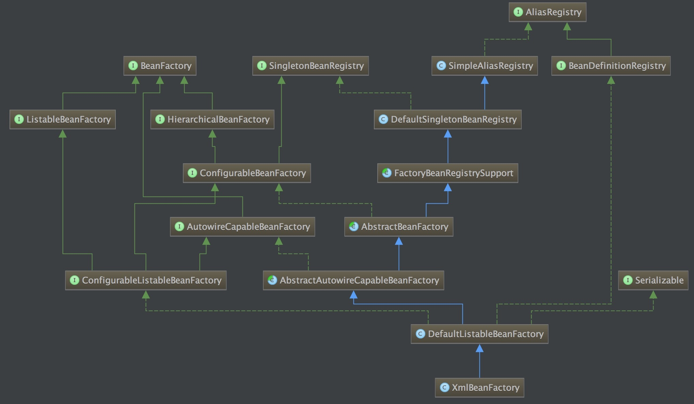
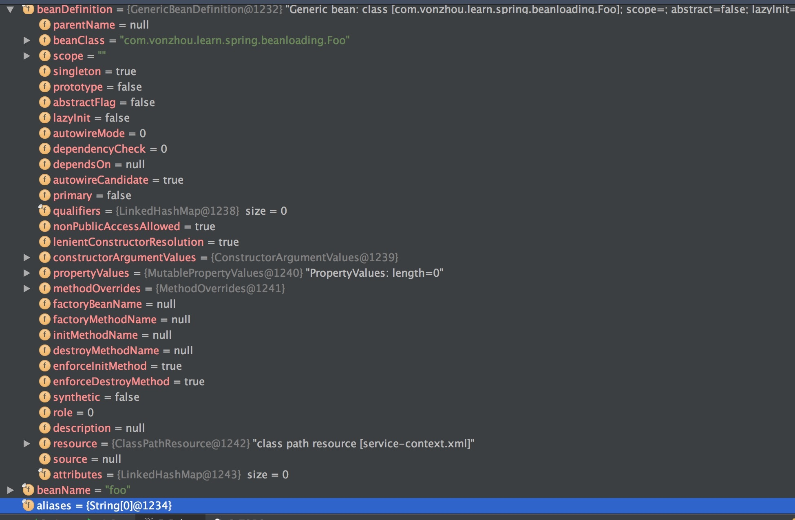

[主页](http://vonzhou.com)  | [读书](https://github.com/vonzhou/readings)  | [知乎](https://www.zhihu.com/people/vonzhou) | [GitHub](https://github.com/vonzhou)
---
# Spring源码阅读 - bean解析初体验

## 从一个简单例子开始

通过一个简单的bean加载例子来热热身，虽然我们平时不使用这里的XmlBeanFactory,而是用ApplicationContext,但是后面我们看到二者还是有共通之处。

```java
public class Foo {
    public void execute(){
        System.out.println("Foo execute...");
    }
}

public class TestFoo {

    @Test
    public void testExecute(){
        BeanFactory factory = new XmlBeanFactory(new ClassPathResource("service-context.xml"));
        Foo bean = (Foo) factory.getBean("foo");
        bean.execute();
    }
}
```

配置文件：

```xml
<beans xmlns="http://www.springframework.org/schema/beans"
       xmlns:xsi="http://www.w3.org/2001/XMLSchema-instance"
       xsi:schemaLocation="
		http://www.springframework.org/schema/beans http://www.springframework.org/schema/beans/spring-beans.xsd">

    <bean id="foo" class="com.vonzhou.learn.spring.beanloading.Foo"/>
</beans>
```

## 从资源文件得到DOM对象

那么就开始吧！先看看XmlBeanFactory所处的地位。



XmlBeanFactory扩展了DefaultListableBeanFactory，使用XmlBeanDefinitionReader从XML配置文件中读取bean的定义。忽略其他的细节，我们先来看看这个配置文件（是一种Resource）是如何被加载的。跟踪进去，进入XmlBeanDefinitionReader#loadBeanDefinitions方法，然后扑面而来的是下面这个重要的方法。

```java
public int loadBeanDefinitions(EncodedResource encodedResource) throws BeanDefinitionStoreException {
		Assert.notNull(encodedResource, "EncodedResource must not be null");
		if (logger.isInfoEnabled()) {
			logger.info("Loading XML bean definitions from " + encodedResource.getResource());
		}

		Set<EncodedResource> currentResources = this.resourcesCurrentlyBeingLoaded.get();
		if (currentResources == null) {
			currentResources = new HashSet<EncodedResource>(4);
			this.resourcesCurrentlyBeingLoaded.set(currentResources);
		}
		if (!currentResources.add(encodedResource)) {
			throw new BeanDefinitionStoreException(
					"Detected cyclic loading of " + encodedResource + " - check your import definitions!");
		}
		try {
			InputStream inputStream = encodedResource.getResource().getInputStream();
			try {
				InputSource inputSource = new InputSource(inputStream);
				if (encodedResource.getEncoding() != null) {
					inputSource.setEncoding(encodedResource.getEncoding());
				}
				return doLoadBeanDefinitions(inputSource, encodedResource.getResource());
			}
			finally {
				inputStream.close();
			}
		}
		catch (IOException ex) {
			throw new BeanDefinitionStoreException(
					"IOException parsing XML document from " + encodedResource.getResource(), ex);
		}
		finally {
			currentResources.remove(encodedResource);
			if (currentResources.isEmpty()) {
				this.resourcesCurrentlyBeingLoaded.remove();
			}
		}
	}
```

成员变量resourcesCurrentlyBeingLoaded是一个ThreadLocal，所以资源文件多线程加载是安全的，同时使用HashSet判断资源文件的循环加载，接下来就是读取我们的资源文件了， 其中InputSource表征一个XML实体的输入源，包装了几个字段。

```java
private String publicId;
    private String systemId;
    private InputStream byteStream;
    private String encoding;
    private Reader characterStream;
```

从输入源InputSource中获得表示该XML文件的Document对象，后续就是操纵这个document。

```java
protected int doLoadBeanDefinitions(InputSource inputSource, Resource resource)
			throws BeanDefinitionStoreException {
		try {
			int validationMode = getValidationModeForResource(resource);
			Document doc = this.documentLoader.loadDocument(
					inputSource, getEntityResolver(), this.errorHandler, validationMode, isNamespaceAware());
			return registerBeanDefinitions(doc, resource);
		}
		catch (BeanDefinitionStoreException ex) {
			throw ex;
		}
		catch (SAXParseException ex) {
			throw new XmlBeanDefinitionStoreException(resource.getDescription(),
					"Line " + ex.getLineNumber() + " in XML document from " + resource + " is invalid", ex);
		}
		catch (SAXException ex) {
			throw new XmlBeanDefinitionStoreException(resource.getDescription(),
					"XML document from " + resource + " is invalid", ex);
		}
		catch (ParserConfigurationException ex) {
			throw new BeanDefinitionStoreException(resource.getDescription(),
					"Parser configuration exception parsing XML from " + resource, ex);
		}
		catch (IOException ex) {
			throw new BeanDefinitionStoreException(resource.getDescription(),
					"IOException parsing XML document from " + resource, ex);
		}
		catch (Throwable ex) {
			throw new BeanDefinitionStoreException(resource.getDescription(),
					"Unexpected exception parsing XML document from " + resource, ex);
		}
	}
```

## 解析DOM对象里的bean

然后就是根据Spring的"spring-beans" DTD（就是我们在配置文件开始制定的命名空间和location），注册该DOM对象里面的bean。

```java
public int registerBeanDefinitions(Document doc, Resource resource) throws BeanDefinitionStoreException {
		// Read document based on new BeanDefinitionDocumentReader SPI.
		BeanDefinitionDocumentReader documentReader = createBeanDefinitionDocumentReader();
		int countBefore = getRegistry().getBeanDefinitionCount();
		documentReader.registerBeanDefinitions(doc, createReaderContext(resource));
		return getRegistry().getBeanDefinitionCount() - countBefore;
	}


public void registerBeanDefinitions(Document doc, XmlReaderContext readerContext) {
		this.readerContext = readerContext;

		logger.debug("Loading bean definitions");
		Element root = doc.getDocumentElement();

		BeanDefinitionParserDelegate delegate = createHelper(readerContext, root);

		preProcessXml(root);
		parseBeanDefinitions(root, delegate);
		postProcessXml(root);
	}
```

后续的工作就是解析这里的DOM对象，从根节点开始，处理每个node，每个元素可以是默认命名空间有的(如"import", "alias", "bean")，也可以是自定义的。

```java
protected void parseBeanDefinitions(Element root, BeanDefinitionParserDelegate delegate) {
		if (delegate.isDefaultNamespace(root)) {
			NodeList nl = root.getChildNodes();
			for (int i = 0; i < nl.getLength(); i++) {
				Node node = nl.item(i);
				if (node instanceof Element) {
					Element ele = (Element) node;
					if (delegate.isDefaultNamespace(ele)) {
						parseDefaultElement(ele, delegate);
					}
					else {
						delegate.parseCustomElement(ele);
					}
				}
			}
		}
		else {
			delegate.parseCustomElement(root);
		}
	}
```

我们重点是看bean的定义是如何实现的，其他的先不关注。

```java
private void parseDefaultElement(Element ele, BeanDefinitionParserDelegate delegate) {
		if (delegate.nodeNameEquals(ele, IMPORT_ELEMENT)) {
			importBeanDefinitionResource(ele);
		}
		else if (delegate.nodeNameEquals(ele, ALIAS_ELEMENT)) {
			processAliasRegistration(ele);
		}
		else if (delegate.nodeNameEquals(ele, BEAN_ELEMENT)) {
			processBeanDefinition(ele, delegate);
		}
	}
```

## 解析bean标签

接下来就是具体处理一个bean定义的过程，想象现在正在解析<bean id="foo" class="com.vonzhou.learn.spring.beanloading.Foo"/>这个元素。

```
protected void processBeanDefinition(Element ele, BeanDefinitionParserDelegate delegate) {
		BeanDefinitionHolder bdHolder = delegate.parseBeanDefinitionElement(ele);
		if (bdHolder != null) {
			bdHolder = delegate.decorateBeanDefinitionIfRequired(ele, bdHolder);
			try {
				// Register the final decorated instance.
				BeanDefinitionReaderUtils.registerBeanDefinition(bdHolder, getReaderContext().getRegistry());
			}
			catch (BeanDefinitionStoreException ex) {
				getReaderContext().error("Failed to register bean definition with name '" +
						bdHolder.getBeanName() + "'", ele, ex);
			}
			// Send registration event.
			getReaderContext().fireComponentRegistered(new BeanComponentDefinition(bdHolder));
		}
	}
```

接下来委派给BeanDefinitionParserDelegate来专门解析XML里的bean定义，如果深究下去太多了，暂时先略过其中的细节，解析成功后返回一个 BeanDefinitionHolder.

```java
public BeanDefinitionHolder parseBeanDefinitionElement(Element ele, BeanDefinition containingBean) {
		String id = ele.getAttribute(ID_ATTRIBUTE);
		String nameAttr = ele.getAttribute(NAME_ATTRIBUTE);

		List<String> aliases = new ArrayList<String>();
		if (StringUtils.hasLength(nameAttr)) {
			String[] nameArr = StringUtils.tokenizeToStringArray(nameAttr, BEAN_NAME_DELIMITERS);
			aliases.addAll(Arrays.asList(nameArr));
		}

		String beanName = id;
		if (!StringUtils.hasText(beanName) && !aliases.isEmpty()) {
			beanName = aliases.remove(0);
			if (logger.isDebugEnabled()) {
				logger.debug("No XML 'id' specified - using '" + beanName +
						"' as bean name and " + aliases + " as aliases");
			}
		}

		if (containingBean == null) {
			checkNameUniqueness(beanName, aliases, ele);
		}

		AbstractBeanDefinition beanDefinition = parseBeanDefinitionElement(ele, beanName, containingBean);
		if (beanDefinition != null) {
			if (!StringUtils.hasText(beanName)) {
				try {
					if (containingBean != null) {
						beanName = BeanDefinitionReaderUtils.generateBeanName(
								beanDefinition, this.readerContext.getRegistry(), true);
					}
					else {
						beanName = this.readerContext.generateBeanName(beanDefinition);
						// Register an alias for the plain bean class name, if still possible,
						// if the generator returned the class name plus a suffix.
						// This is expected for Spring 1.2/2.0 backwards compatibility.
						String beanClassName = beanDefinition.getBeanClassName();
						if (beanClassName != null &&
								beanName.startsWith(beanClassName) && beanName.length() > beanClassName.length() &&
								!this.readerContext.getRegistry().isBeanNameInUse(beanClassName)) {
							aliases.add(beanClassName);
						}
					}
					if (logger.isDebugEnabled()) {
						logger.debug("Neither XML 'id' nor 'name' specified - " +
								"using generated bean name [" + beanName + "]");
					}
				}
				catch (Exception ex) {
					error(ex.getMessage(), ele);
					return null;
				}
			}
			String[] aliasesArray = StringUtils.toStringArray(aliases);
			return new BeanDefinitionHolder(beanDefinition, beanName, aliasesArray);
		}

		return null;
	}
```

我们来看看BeanDefinitionHolder的结构，其中包含BeanDefinition,bean name 以及bean的别名，可以通过debug，加深理解。




## 注册bean definition

当我们bean definition解析之后，就要进行注册，注册到bean factory中。

```java
public static void registerBeanDefinition(
			BeanDefinitionHolder definitionHolder, BeanDefinitionRegistry registry)
			throws BeanDefinitionStoreException {

		// Register bean definition under primary name.
		String beanName = definitionHolder.getBeanName();
		registry.registerBeanDefinition(beanName, definitionHolder.getBeanDefinition());

		// Register aliases for bean name, if any.
		String[] aliases = definitionHolder.getAliases();
		if (aliases != null) {
			for (String aliase : aliases) {
				registry.registerAlias(beanName, aliase);
			}
		}
	}
```

这项工作由实现了BeanDefinitionRegistry接口的DefaultListableBeanFactory类实现的。

```java
public void registerBeanDefinition(String beanName, BeanDefinition beanDefinition)
			throws BeanDefinitionStoreException {

		Assert.hasText(beanName, "Bean name must not be empty");
		Assert.notNull(beanDefinition, "BeanDefinition must not be null");

		if (beanDefinition instanceof AbstractBeanDefinition) {
			try {
				((AbstractBeanDefinition) beanDefinition).validate();
			}
			catch (BeanDefinitionValidationException ex) {
				throw new BeanDefinitionStoreException(beanDefinition.getResourceDescription(), beanName,
						"Validation of bean definition failed", ex);
			}
		}

		synchronized (this.beanDefinitionMap) {
			Object oldBeanDefinition = this.beanDefinitionMap.get(beanName);
			if (oldBeanDefinition != null) {
				if (!this.allowBeanDefinitionOverriding) {
					throw new BeanDefinitionStoreException(beanDefinition.getResourceDescription(), beanName,
							"Cannot register bean definition [" + beanDefinition + "] for bean '" + beanName +
							"': There is already [" + oldBeanDefinition + "] bound.");
				}
				else {
					if (this.logger.isInfoEnabled()) {
						this.logger.info("Overriding bean definition for bean '" + beanName +
								"': replacing [" + oldBeanDefinition + "] with [" + beanDefinition + "]");
					}
				}
			}
			else {
				this.beanDefinitionNames.add(beanName);
				this.frozenBeanDefinitionNames = null;
			}
			this.beanDefinitionMap.put(beanName, beanDefinition);

			resetBeanDefinition(beanName);
		}
	}
```

可以看到就是把bean的定义存储在一个Map中,同时对于重复定义的bean也会报错，同时也把 bean definition name 有序的存在beanDefinitionNames数组中。

```java
/** Map of bean definition objects, keyed by bean name */
private final Map<String, BeanDefinition> beanDefinitionMap = new ConcurrentHashMap<String, BeanDefinition>();
```

## 小结

本文就跟了下 bean 的加载过程，到最后你会发现就是解析XML文件，把需要的信息存储到内存中，后续就可以取出bean的定义信息，根据反射操纵对应的方法。